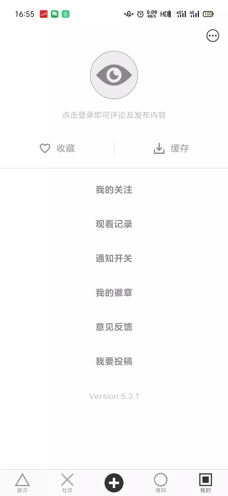

# compose-eyepetizer

[][1]
[][2]
[][3]

基于 [Kotlin][11] 语言，采用 [Jetpack][12] [Compose][13] + [Retrofit2][14] + [协程][15] + [Coil][16] 实现的 [MVI][17] 架构，
高仿「[开眼 Eyepetizer][17]」的一个 Android 客户端项目。 此项目开发规范参考了 [Kotlin 官方文档][19]
与第三方 [AndroidStandardDevelop][20]。
通过此项目，新手可以快速入门 Kotlin 语言，掌握 MVI 架构，更好地熟悉 Jetpack 组件以及 Compose 的使用。

这款 App 的 UI 对应的是「开眼 Eyepetizer」的 v6.3.1 版本。（[查看历史版本][21]）

## 屏幕截图





## License

**所有数据来源于开眼，仅供学习和交流使用，严禁用于任何商业用途，原作公司拥有所有权利。**

```
Copyright 2023 FPhoenixCorneaE.

Licensed under the Apache License, Version 2.0 (the "License");
you may not use this file except in compliance with the License.
You may obtain a copy of the License at

    http://www.apache.org/licenses/LICENSE-2.0

Unless required by applicable law or agreed to in writing, software
distributed under the License is distributed on an "AS IS" BASIS,
WITHOUT WARRANTIES OR CONDITIONS OF ANY KIND, either express or implied.
See the License for the specific language governing permissions and
limitations under the License.
```

[1]:https://github.com/FPhoenixCorneaE/

[2]:https://android-arsenal.com/api?level=24#l24

[3]:https://www.apache.org/licenses/LICENSE-2.0

[11]:https://kotlinlang.org

[12]:https://developer.android.com/jetpack

[13]:https://developer.android.com/jetpack/compose

[14]:https://square.github.io/retrofit/

[15]:https://github.com/Kotlin/kotlinx.coroutines

[16]:https://coil-kt.github.io/coil/

[17]:https://www.kodeco.com/817602-mvi-architecture-for-android-tutorial-getting-started#toc-anchor-002

[18]:https://www.kaiyanapp.com

[19]:https://www.kotlincn.net/docs/reference/coding-conventions.html

[20]:https://github.com/Blankj/AndroidStandardDevelop

[21]:https://www.wandoujia.com/apps/6619883/history_y2023
